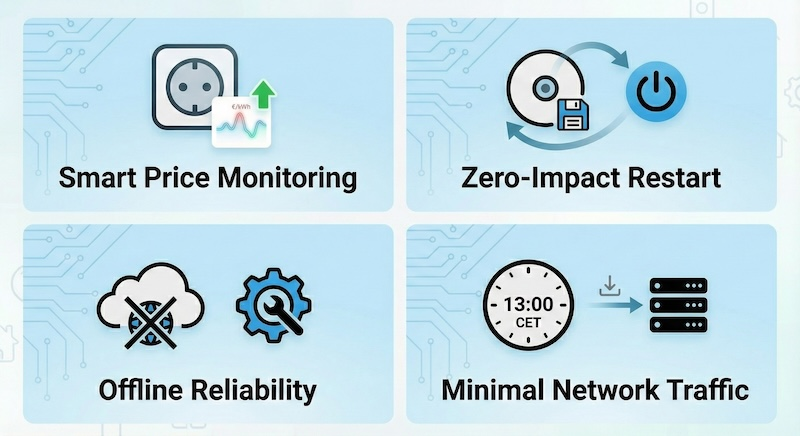

# Tibber Prices Integration for Home Assistant

This project is a specialized Home Assistant integration focused solely on the robust retrieval of Tibber energy prices. It is engineered to ensure high availability of pricing data through advanced caching and fault-tolerant design, guaranteeing that your energy automations function reliably even during network interruptions.

## Installation

### Method 1: HACS (Recommended)

1. Open **HACS** in your Home Assistant instance.
2. Click on **Integrations**.
3. Click the three dots in the top right corner and select **Custom repositories**.
4. Add the URL of this repository.
5. Select **Integration** as the category.
6. Click **Add**.
7. Once added, find **Tibber Prices** in the HACS store and click **Download**.
8. Restart Home Assistant.

### Method 2: Manual Installation

1. Download or clone this repository.
2. Locate the `custom_components/tibber_prices` directory.
3. Copy the entire `tibber_prices` folder into your Home Assistant's `custom_components` directory.
   - If the `custom_components` directory does not exist, create it in your configuration directory (where `configuration.yaml` is located).
4. Restart Home Assistant.

## Configuration

After installation and restart:

1. Go to **Settings** > **Devices & Services** in Home Assistant.
2. Click **+ ADD INTEGRATION** in the bottom right corner.
3. Search for **Tibber Prices**.
4. Select it and follow the configuration flow.
   - You will be prompted to enter your **Tibber API Access Token**. You can generate one at [developer.tibber.com](https://developer.tibber.com/).
   - **Multiple Homes**: If your Tibber account has multiple homes, you will be prompted to select which home to add. To add multiple homes, simply add the integration again for each home you wish to monitor.
5. Once configured, the integration will start fetching price data.

## Features

- **Smart Price Monitoring**: Fetches current and future electricity prices for your home.
- **Zero-Impact Restart**: Prices are persisted to disk, so restarting Home Assistant **does not require a new API call**. Everything works instantly using the local cache.
- **Offline Reliability**: Your automations continue to work even if the internet goes down or the Tibber API is unreachable, thanks to aggressive local caching.
- **Minimal Network Traffic**: Intelligently schedules updates *only* when new prices are expected (typically around 13:00 CET), eliminating unnecessary polling.
- **API Friendly**: Implements randomized jitter for update schedules to prevent thundering herd issues, making it a "good citizen" to the Tibber API.

## Support

If you encounter any issues, please open an issue in this repository.

## Disclaimer

This component is not affiliated with, endorsed by, or associated with Tibber. "Tibber" is a trademark of Tibber. This integration is an independent open-source project that uses the public Tibber API.

